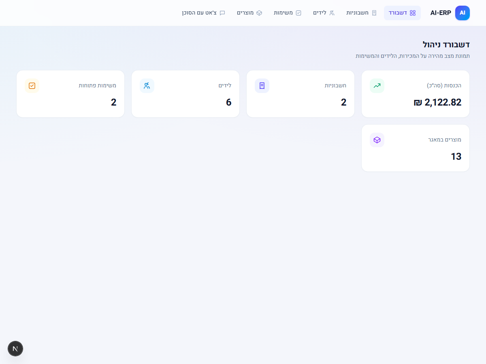
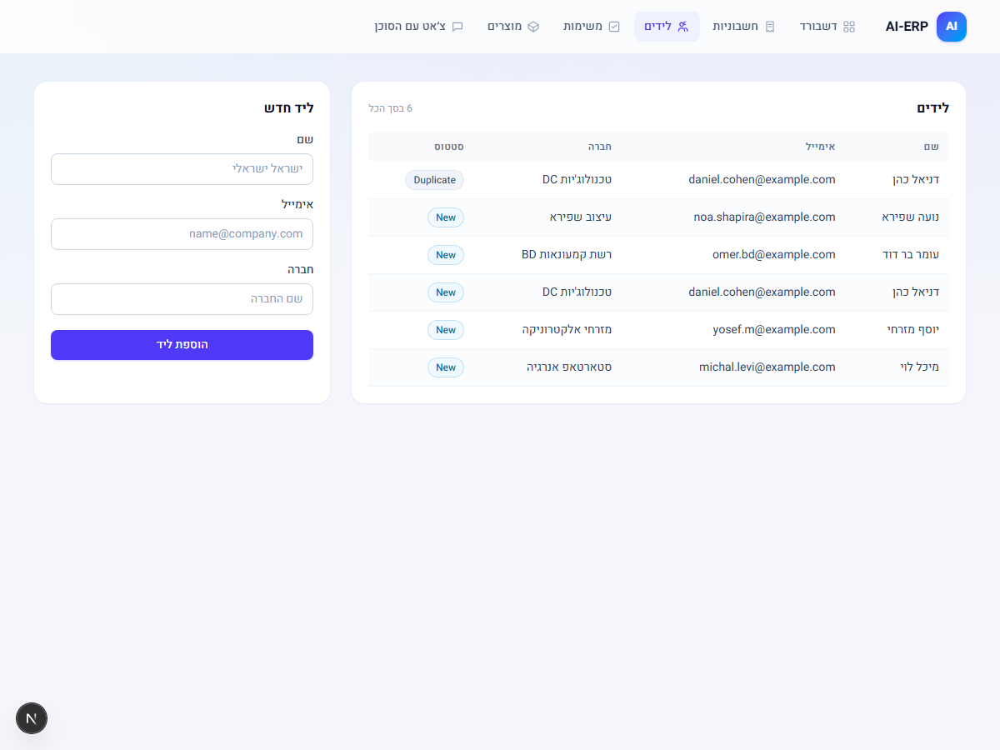
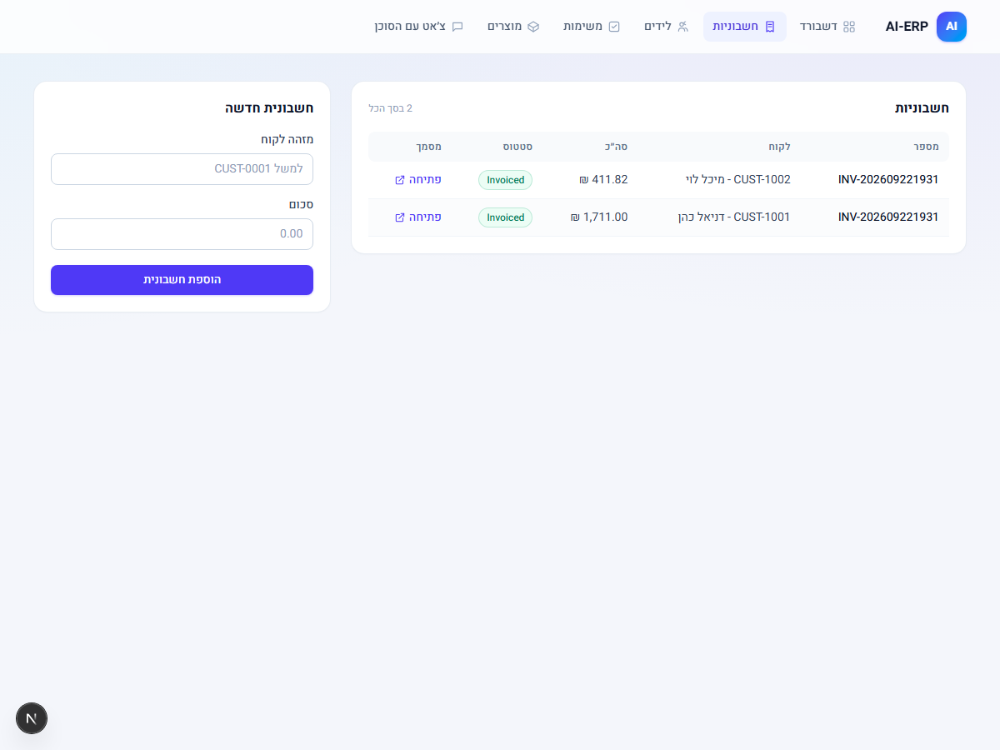
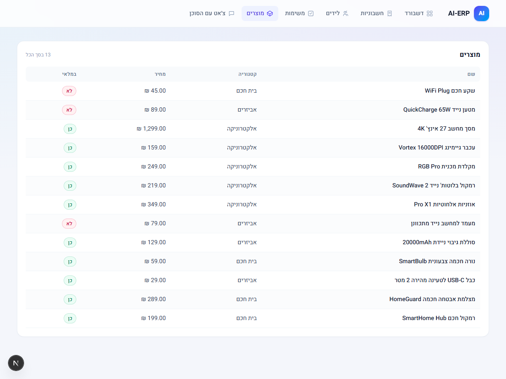
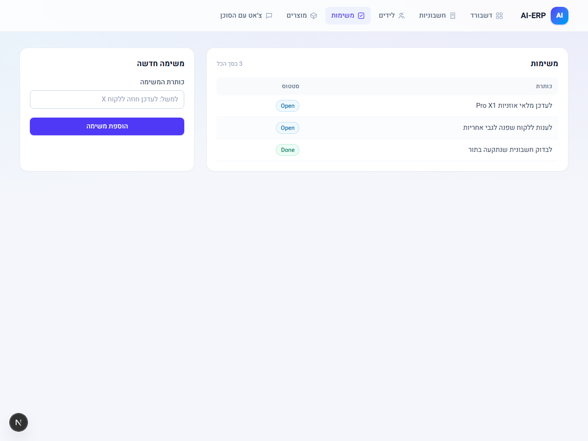
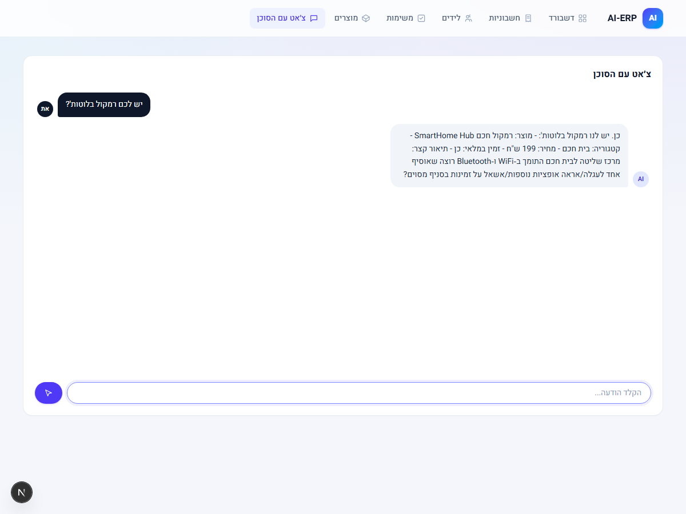

# פרויקט גמר - AI ERP (No-Code)

פרויקט גמר בקורס John Bryce: מערכת ERP קטנה מבוססת AI לעסק אלקטרוניקה פיקטיבי, בנויה על
**Airtable** (נתונים) + **n8n** self-hosted (10 אוטומציות + WF0 מטפל שגיאות + 3 סוכני AI +
מאגר וקטורי RAG) + **Next.js** (דשבורד ניהול אמיתי, לא no-code).

```
 דשבורד (Next.js) ──POST /webhook/ai-erp-app──▶ WF13 ──▶ ניתוב לפי action
                                                              │
                 ┌────────────────────────────────────────────┼─────────────────────┐
                 ▼                                             ▼                     ▼
          action=chat (RAG)                         createLead/createTask     createInvoice
                                                              │                       │
                                                              ▼                       ▼
                                                    WF3 → WF4a → WF4b            WF1 → WF8

 לקוח ──Telegram──▶ WF5 (RAG)      מנהל ──Telegram──▶ WF9      כל כשל ──▶ WF0 ──▶ התראת Telegram
```

פירוט מלא: [docs/architecture.md](docs/architecture.md).

## מבנה הריפו

- `workflows/` - 11 אוטומציות n8n (WF0 מטפל שגיאות + 10 workflows), ייצוא מדויק מהמופע החי
  (`n8n.nativ-ai.co.il`), כולל sticky notes בעברית על כל workflow וחיבור ל-Error Workflow.
- `app/` - דשבורד הניהול (Next.js אמיתי, לא no-code), כולל צ'אט AI, ניהול לידים, משימות וחשבוניות.
- `docs/` - ארכיטקטורה, סכימת Airtable, תסריט דמו, שאלות צפויות, בריף הקורס המקורי.
- `policies/`, `data/` - תיעוד מקור התוכן שמוזן למאגר הווקטורי (RAG) של WF6/WF7.
- `scripts/smoke-test.mjs` - בדיקת בריאות קצה-לקצה (Airtable + webhook n8n).

## האוטומציות (workflows/)

| קובץ | תיאור | טריגר |
|---|---|---|
| WF0-error-handler.json | מטפל שגיאות מרכזי - התראת Telegram למנהל בכל כשל בכל workflow אחר | Error Trigger |
| WF1-verify-tax-documents.json | חישוב מע"מ, סה"כ ומספר חשבונית; מסמן ValidatedQueued | Airtable polling (כל דקה) |
| WF3-intake-contacts-dedupe.json | קליטת לידים וסינון כפילויות לפי אימייל | Airtable polling (כל דקה) |
| WF4a-sales-cold-emails.json | סוכן AI מנסח ושולח מייל קר ללידים חדשים (**כבוי כברירת מחדל**) | Schedule (כל 3 שעות) |
| WF4b-sales-reply-triage.json | סוכן AI מסווג תשובות לידים (מעוניין/לא מעוניין/שאלה) | Gmail polling (כל 30 דק') |
| WF5-customer-service-agent.json | סוכן שירות לקוחות בטלגרם, RAG על מדיניות ומוצרים | Telegram |
| WF6-policies-to-vector-store.json | טעינת מדיניות החברה למאגר וקטורי (RAG) | הפעלה ידנית |
| WF7-products-to-vector-store.json | טעינת קטלוג המוצרים מ-Airtable למאגר וקטורי (RAG) | הפעלה ידנית |
| WF8-invoice-generation-drive-upload.json | הפקת מסמך חשבונית (HTML) והעלאה ל-Google Drive | Schedule (כל דקה) |
| WF9-admin-agent.json | סוכן AI למנהל העסק בטלגרם - שאלות על חשבוניות והכנסות | Telegram |
| WF13-app-request-intake.json | Webhook יחיד שמקבל את כל בקשות הדשבורד (צ'אט, יצירת ליד/משימה/חשבונית) | Webhook |

כל node בכל workflow מתועד ב-sticky note בעברית — הקנבס מסביר את עצמו. הקבצים מכילים את
ה-`nodeId`-ים, `credentials` references (שמות בלבד, לא ערכים/סודות) וה-expressions המקוריים.
כדי לייבא: n8n → Workflows → Import from File, ולחבר מחדש את הקרדנציאלים המתאימים
(Airtable PAT, OpenAI, Google Drive/Gmail OAuth, שני בוטי Telegram) — ואת WF0 כ-Error Workflow
בהגדרות של כל workflow אחר.

## דשבורד (app/)

Next.js app אמיתי (לא no-code) עם קריאה ישירה מ-Airtable REST API לתצוגה, וכתיבה/צ'אט אך ורק
דרך ה-webhook היחיד של WF13 (ה-PAT של Airtable לא נחשף לדפדפן). ראו `app/README.md` להרצה מקומית.
יש להעתיק `.env.local.example` ל-`.env.local` ולמלא `AIRTABLE_PAT` ו-`N8N_WEBHOOK_URL` בפועל
(לא נכללים בריפו).

## מגבלות ידועות (בכוונה, לשם פשטות)

- **המאגר הווקטורי (RAG) חי בזיכרון של n8n בלבד** - מתאפס בכל restart. יש להריץ ידנית WF6 ואז
  WF7 (Execute workflow) לפני כל דמו/שימוש.
- מספר חשבונית מבוסס timestamp (`INV-YYYYMMDDHHmm`), לא מונה רץ - שתי חשבוניות באותה דקה בדיוק
  עלולות להתנגש (זה קרה בפועל בדאטה לדמו - שתי החשבוניות בסיד קיבלו אותו מספר כי נוצרו באותה
  שנייה); הבחירה נעשתה כדי להימנע מתלות במונה חיצוני.
- **המסמך המופק הוא HTML תקין, אבל דרייב לא מרנדר אותו ב-preview** - בדקנו את זה חי: הקובץ
  מועלה עם `mimeType: text/html` נכון (node "Convert to File" + `operation: upload` בינארי,
  לא `createFromText` שתמיד מעלה כ-`text/plain`), והתוכן שלו כשמורידים אותו הוא HTML תקין
  לגמרי. אבל ה-preview המובנה של Google Drive **לא מרנדר קבצי HTML שהועלו ישירות בשום מקרה**
  (הגבלת אבטחה של Drive עצמו, לא קשורה ל-mimeType) - כך שלחיצה על "פתיחה" מהאפליקציה מציגה
  את קוד המקור כטקסט גולמי. כדי לראות את החשבונית מעוצבת: **צריך להוריד את הקובץ ולפתוח אותו
  מקומית בדפדפן**, או לבחור "פתיחה באמצעות Google Docs" מהתפריט בדף הקובץ ב-Drive. אין דרך
  לגרום ל-Drive לרנדר HTML ב-preview שלו עצמו - זו מגבלה של הפלטפורמה, לא באג בוורקפלואו.
- WF4a (מיילים קרים) כבוי בכוונה כברירת מחדל - שולח מיילים אמיתיים ללידים אמיתיים על בסיס Schedule.
- סוכן המנהל (WF9) קורא בלבד, ללא כלים נוספים, ורואה עד 100 חשבוניות אחרונות.
- האפליקציה חד-משתמשת, ללא הרשאות/אימות משתמשים.

## צילומי מסך (מריצה חיה, 2026-09-22)

| דשבורד | לידים |
|---|---|
|  |  |

| חשבוניות | מוצרים |
|---|---|
|  |  |

| משימות | צ'אט (RAG חי, תשובה אמיתית מהמלאי) |
|---|---|
|  |  |

פירוט מלא, תסריט דמו ושאלות צפויות: [docs/](docs/).
